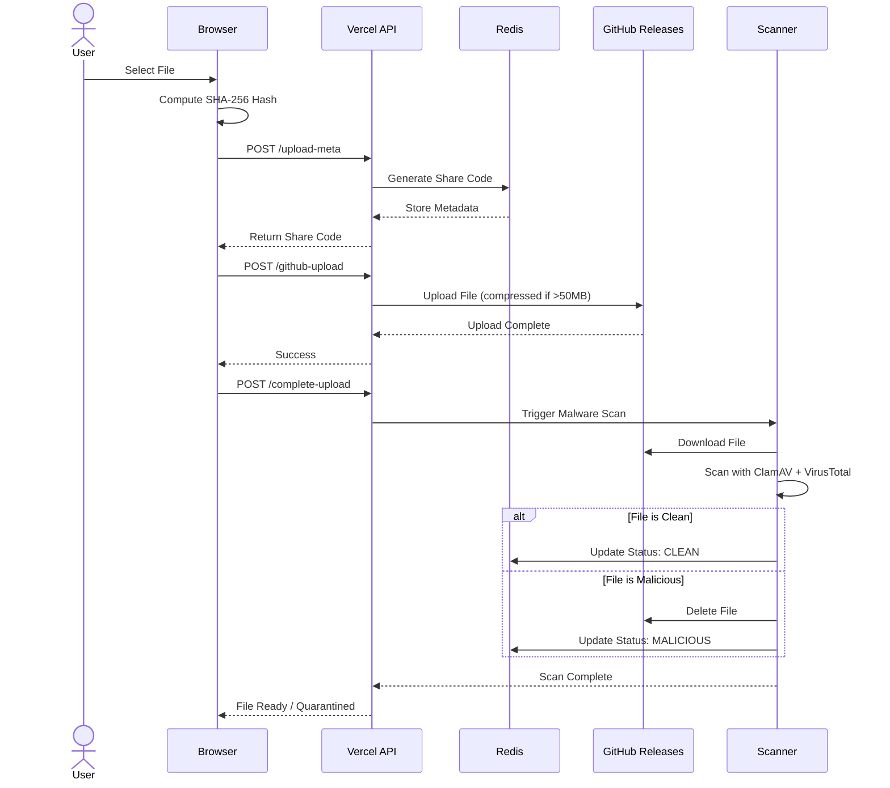
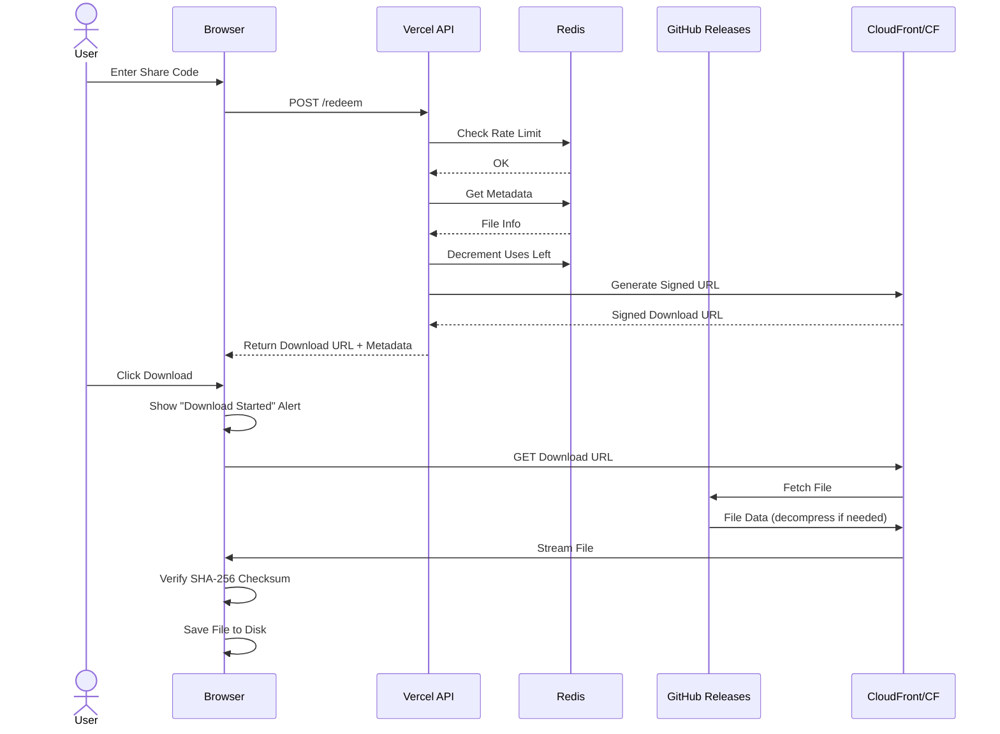
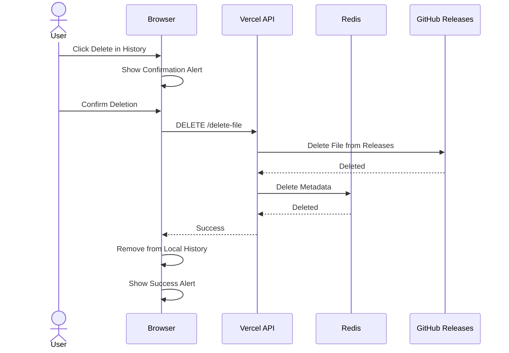

# 📊 FileDuck - Technical Architecture

## System Overview

FileDuck is a globally distributed, secure file-sharing platform built with modern web technologies. It solves three critical pain points in file sharing: speed, security, and privacy.

## Architecture Diagram

```mermaid
flowchart TD
    A[User Browser] -->|1. Upload File| B[Vue 3 Frontend]
    B -->|2. Pre-scan| C[ClamAV + VirusTotal]
    C -->|3. Clean?| D{Scan Result}
    D -->|Clean| E[Calculate SHA-256]
    D -->|Infected| F[Show Warning - Quarantine]
    E -->|4. Request Upload| G[Vercel API /upload-meta]
    G -->|5. Generate Share Code| H[Upstash Redis]
    H -->|Store Metadata + TTL| G
    G -->|6. Return Share Code| B
    B -->|7. Upload File Data| I[/api/github-upload]
    I -->|8. Create GitHub Release| J[GitHub Releases Storage]
    J -->|9. Return Download URL| I
    I -->|10. Update Metadata| H
    H -->|Store downloadUrl + releaseId| I
    I -->|Success| B
    B -->|Display Share Code| A
    
    %% Download Flow
    K[Recipient] -->|1. Enter Share Code| L[Vue 3 Frontend]
    L -->|2. Redeem Code| M[Vercel API /redeem]
    M -->|3. Get Metadata| H
    H -->|Return File Info| M
    M -->|4. Check Uses Left| N{Uses > 0?}
    N -->|Yes| O[Decrement Counter]
    N -->|No| P[Return Error]
    O -->|5. Return Download URL| M
    M -->|GitHub CDN URL| L
    L -->|6. Download File| J
    J -->|File Data| K
    
    %% Cleanup Flow
    Q[Vercel Cron] -->|Daily| R[/api/cleanup-expired]
    R -->|Scan Redis| H
    H -->|Expired Keys| R
    R -->|Delete Release| J
    R -->|Delete Metadata| H
    
    %% Delete Flow
    S[User History] -->|Delete File| T[/api/delete-file]
    T -->|Remove Release| J
    T -->|Remove Metadata| H
    T -->|Success| S
    
    style B fill:#9333ea,color:#fff
    style G fill:#3b82f6,color:#fff
    style H fill:#ef4444,color:#fff
    style J fill:#22c55e,color:#fff
    style C fill:#f59e0b,color:#fff
```

## System Components Architecture

```mermaid
graph TB
    subgraph Client["🖥️ User Device"]
        Browser["Web Browser<br/>Vue 3 App"]
        SHA["SHA-256 Hash<br/>Computation"]
        Encrypt["Optional E2E<br/>Encryption"]
    end

    subgraph Vercel["☁️ Vercel Edge Network"]
        API["Serverless Functions<br/>(Node.js/TypeScript)"]
        UploadMeta["/api/upload-meta"]
        GitHubUpload["/api/github-upload"]
        CompleteUpload["/api/complete-upload"]
        Redeem["/api/redeem"]
        Delete["/api/delete-file"]
        Cleanup["/api/cleanup-expired"]
        Health["/api/health"]
    end

    subgraph Storage["💾 Storage Layer"]
        direction LR
        GitHub["GitHub Releases<br/>(Primary Storage)<br/>• Compression >50MB<br/>• Chunking >1.9GB<br/>• Rate Limited"]
        S3["AWS S3 / MinIO<br/>(Fallback Storage)<br/>• Quarantine Bucket<br/>• Public Bucket"]
    end

    subgraph Cache["⚡ Cache & Metadata"]
        Redis["Upstash Redis<br/>• Metadata Store<br/>• TTL Auto-Expiry<br/>• Rate Limiting<br/>• Atomic Operations"]
    end

    subgraph Security["🛡️ Security Layer"]
        Scanner["Malware Scanner<br/>• ClamAV (Local)<br/>• VirusTotal API<br/>• Quarantine Pipeline"]
    end

    subgraph CDN["🌐 CDN Layer"]
        CloudFront["CloudFront/Cloudflare<br/>• Signed URLs<br/>• Edge Caching<br/>• DDoS Protection"]
    end

    Browser -->|1. Select File| SHA
    SHA -->|2. Compute Hash| Browser
    Browser -->|3. Optional| Encrypt
    Browser -->|4. POST /upload-meta| UploadMeta
    UploadMeta -->|5. Generate Share Code| Redis
    Redis -->|6. Store Metadata| UploadMeta
    UploadMeta -->|7. Return Presigned URLs| Browser
    Browser -->|8. Upload File| GitHubUpload
    GitHubUpload -->|9. Store (Compressed)| GitHub
    GitHub -->|10. Fallback if needed| S3
    Browser -->|11. POST /complete-upload| CompleteUpload
    CompleteUpload -->|12. Trigger Scan| Scanner
    Scanner -->|13. Download from Storage| GitHub
    Scanner -->|14. Scan with ClamAV + VT| Scanner
    Scanner -->|15. If Clean: Update Status| Redis
    Scanner -->|16. If Malicious: Delete| GitHub
    
    %% Download Flow
    Browser -->|17. POST /redeem| Redeem
    Redeem -->|18. Check Rate Limit| Redis
    Redeem -->|19. Get Metadata| Redis
    Redis -->|20. Return File Info| Redeem
    Redeem -->|21. Decrement Uses| Redis
    Redeem -->|22. Generate Signed URL| CloudFront
    CloudFront -->|23. Return Download URL| Browser
    Browser -->|24. Download File| CloudFront
    CloudFront -->|25. Fetch from Storage| GitHub
    GitHub -->|26. Decompress if needed| CloudFront
    CloudFront -->|27. Stream to User| Browser
    
    %% Delete Flow
    Browser -->|28. DELETE request| Delete
    Delete -->|29. Delete from Storage| GitHub
    Delete -->|30. Delete Metadata| Redis
    
    %% Cleanup Flow
    Cleanup -->|31. Get Expired Keys| Redis
    Cleanup -->|32. Delete Files| GitHub
    Cleanup -->|33. Remove Metadata| Redis

    style Client fill:#e1f5ff
    style Vercel fill:#fff4e6
    style Storage fill:#f0f9ff
    style Cache fill:#fef3c7
    style Security fill:#fee2e2
    style CDN fill:#dcfce7
```

## Detailed Flow Diagrams

### Upload Flow Sequence



### Download Flow Sequence



### Delete Flow Sequence



## Component Details

### Frontend (Vue 3 + Vite)

**Location**: `apps/vue-app/`

**Key Features**:
- Client-side SHA-256 hashing using Web Crypto API
- Drag-and-drop file upload interface
- Real-time upload progress tracking
- Share code management
- Download link generation
- Responsive design with Tailwind CSS

**Tech Stack**:
- Vue 3 (Composition API)
- Vite (build tool)
- Vue Router (routing)
- Pinia (state management)
- Axios (HTTP client)
- Tailwind CSS (styling)

**Key Files**:
- [src/views/UploadView.vue](apps/vue-app/src/views/UploadView.vue) - Upload interface
- [src/views/DownloadView.vue](apps/vue-app/src/views/DownloadView.vue) - Download interface
- [src/services/api.ts](apps/vue-app/src/services/api.ts) - API client

### Backend API (Vercel Serverless)

**Location**: `apps/api/`

**Endpoints**:

| Endpoint | Method | Purpose |
|----------|--------|---------|
| `/upload-meta` | POST | Generate share code & presigned upload URLs |
| `/complete-upload` | POST | Complete multipart upload, trigger scan |
| `/redeem` | POST | Validate code, return signed download URL |
| `/health` | GET | Health check |

**Tech Stack**:
- TypeScript
- Vercel Edge Functions
- Upstash Redis SDK
- AWS SDK v3 (S3, CloudFront)

**Key Components**:

1. **Redis Integration** ([lib/redis.ts](apps/api/lib/redis.ts))
   - Metadata storage with TTL
   - Atomic GET+DEL for one-time downloads
   - Rate limiting per IP
   - Failed attempt tracking

2. **S3 Integration** ([lib/s3.ts](apps/api/lib/s3.ts))
   - Multipart upload presigning
   - File movement (quarantine → public)
   - Presigned download URLs

3. **CDN Integration** ([lib/cdn.ts](apps/api/lib/cdn.ts))
   - CloudFront signed URLs
   - Custom policy support
   - IP-based restrictions (optional)

### Malware Scanner (Docker Service)

**Location**: `packages/scanner/`

**Architecture**:
- Node.js TypeScript service
- ClamAV daemon integration
- VirusTotal API integration
- S3 file download/cleanup

**Scan Pipeline**:

```
1. Receive scan request (HTTP POST /scan)
2. Download file from S3 quarantine bucket to temp
3. Scan with ClamAV (fast, local)
4. If clean: Scan with VirusTotal (comprehensive)
5. Determine verdict:
   - Clean: Move to public bucket, update Redis
   - Infected: Delete file, flag in Redis, alert
6. Cleanup temp files
7. Return result
```

**Tech Stack**:
- TypeScript + Express
- ClamAV (via clamscan npm package)
- VirusTotal API v3
- AWS SDK (S3 operations)
- Docker (containerization)

**Key Files**:
- [src/scanner.ts](packages/scanner/src/scanner.ts) - Main scan orchestration
- [src/clamav.ts](packages/scanner/src/clamav.ts) - ClamAV integration
- [src/virustotal.ts](packages/scanner/src/virustotal.ts) - VirusTotal integration
- [Dockerfile](packages/scanner/Dockerfile) - Container build

### Shared Package

**Location**: `packages/shared/`

**Purpose**: Common types, utilities, and constants shared across frontend and backend.

**Exports**:
- TypeScript interfaces (`FileMetadata`, `ScanResults`, etc.)
- Utility functions (`generateShareCode`, `computeSHA256`, etc.)
- Constants (`MAX_FILE_SIZE`, `RATE_LIMIT_MAX`, etc.)

## Data Flow

### Upload Flow

```
┌──────┐     ┌─────────┐     ┌──────┐     ┌────────┐     ┌─────────┐
│Client│     │   API   │     │Redis │     │   S3   │     │ Scanner │
└──┬───┘     └────┬────┘     └───┬──┘     └───┬────┘     └────┬────┘
   │              │               │            │               │
   │ Compute SHA-256              │            │               │
   ├──────────────┘               │            │               │
   │              │               │            │               │
   │ POST /upload-meta            │            │               │
   ├─────────────►│               │            │               │
   │              │               │            │               │
   │              │ Generate code │            │               │
   │              ├──────────────►│            │               │
   │              │               │            │               │
   │              │ Store metadata│            │               │
   │              ├──────────────►│            │               │
   │              │               │            │               │
   │              │ Presign URLs  │            │               │
   │              ├───────────────────────────►│               │
   │              │               │            │               │
   │◄─────────────┤ Return URLs   │            │               │
   │              │               │            │               │
   │ Upload chunks (multipart)    │            │               │
   ├───────────────────────────────────────────►               │
   │              │               │            │               │
   │ POST /complete-upload        │            │               │
   ├─────────────►│               │            │               │
   │              │               │            │               │
   │              │ Trigger scan  │            │               │
   │              ├───────────────────────────────────────────►│
   │              │               │            │               │
   │◄─────────────┤ Return code   │            │               │
   │              │               │            │               │
   │              │               │            │    Download   │
   │              │               │            │◄──────────────┤
   │              │               │            │               │
   │              │               │            │    Scan       │
   │              │               │            │    ┌─────┐    │
   │              │               │            │    │ClamAV│   │
   │              │               │            │    └─────┘    │
   │              │               │            │    ┌──────┐   │
   │              │               │            │    │VirusT│   │
   │              │               │            │    └──────┘   │
   │              │               │            │               │
   │              │               │            │ If clean:     │
   │              │               │            │ Move to public│
   │              │               │            │◄──────────────┤
   │              │               │            │               │
   │              │               │ Update status              │
   │              │               │◄───────────────────────────┤
   │              │               │            │               │
```

### Download Flow

```
┌──────┐     ┌─────────┐     ┌──────┐     ┌────────┐     ┌─────────┐
│Client│     │   API   │     │Redis │     │ CDN/S3 │     │         │
└──┬───┘     └────┬────┘     └───┬──┘     └───┬────┘     └─────────┘
   │              │               │            │
   │ Enter code   │               │            │
   ├──────────────┘               │            │
   │              │               │            │
   │ POST /redeem │               │            │
   ├─────────────►│               │            │
   │              │               │            │
   │              │ Check rate limit           │
   │              ├──────────────►│            │
   │              │               │            │
   │              │ Get metadata  │            │
   │              ├──────────────►│            │
   │              │               │            │
   │              │ Check status  │            │
   │              │◄──────────────┤            │
   │              │               │            │
   │              │ Decrement uses│            │
   │              ├──────────────►│            │
   │              │               │            │
   │              │ Generate signed URL        │
   │              ├───────────────────────────►│
   │              │               │            │
   │◄─────────────┤ Return URL    │            │
   │              │               │            │
   │ Download file│               │            │
   ├───────────────────────────────────────────►
   │              │               │            │
   │ Verify SHA-256               │            │
   ├──────────────┘               │            │
```

## Security Measures

### Layer 1: Input Validation

- Share code format validation (8-10 base62 characters)
- File size limits (5 GB max)
- MIME type validation
- SHA-256 format validation

### Layer 2: Rate Limiting

- IP-based throttling (10 req/min)
- Redis-backed counters
- Exponential backoff on failures
- CAPTCHA after 3 failed attempts

### Layer 3: Malware Scanning

**Quarantine Pipeline**:
1. All uploads go to quarantine bucket
2. Files blocked from public access
3. ClamAV signature-based scan
4. VirusTotal multi-engine scan (70 engines)
5. Score-based verdict (≥3/70 = infected)
6. Infected files deleted immediately
7. Clean files moved to public bucket

**Scan Coverage**:
- Viruses, trojans, malware
- Ransomware, rootkits
- Exploits, shellcode
- PUPs (Potentially Unwanted Programs)

### Layer 4: Access Control

**S3 Bucket Policies**:
- Quarantine: Private, no public access
- Public: Restricted to CloudFront OAI only

**CDN Signed URLs**:
- 1-hour expiration
- CloudFront private key signing
- Optional IP-based restrictions
- Optional time-window constraints

### Layer 5: Data Privacy

- **Client-side SHA-256**: Computed in browser, never sent unverified
- **Optional E2E encryption**: AES-256-GCM with key in URL fragment
- **TTL auto-expiry**: Files and metadata automatically deleted
- **One-time downloads**: Atomic operations prevent replay
- **Minimal logging**: No content inspection, only metadata

## Performance Optimizations

### 1. Multipart Uploads

- Files chunked at 100 MB
- Parallel upload to S3
- Faster for large files (>100 MB)
- Resume capability (future)

### 2. CDN Edge Caching

**CloudFront/Cloudflare**:
- 200+ edge locations globally
- Automatic cache invalidation on TTL
- Gzip/Brotli compression
- HTTP/2 support

**Cache Strategy**:
- Hot files: 24-hour TTL
- One-time files: 1-hour TTL
- Adaptive based on access patterns

### 3. Redis Performance

- In-memory storage (<1ms latency)
- TTL-based auto-expiry (no cleanup cron)
- Atomic operations (GET+DEL)
- Connection pooling

### 4. Frontend Optimizations

- Code splitting (Vue Router lazy loading)
- Tree shaking (Vite)
- Asset compression
- Progressive Web App (future)

## Scalability

### Horizontal Scaling

| Component | Scaling Strategy |
|-----------|------------------|
| Frontend | Vercel auto-scales |
| API | Vercel Edge Functions auto-scale |
| Redis | Upstash auto-scales |
| S3 | AWS auto-scales |
| CDN | CloudFront/Cloudflare auto-scales |
| Scanner | Deploy multiple instances, load-balanced |

### Load Estimates

**1000 uploads/day**:
- Redis: ~10K operations/day (free tier)
- S3: ~20 GB storage, 1000 PUTs, 3000 GETs
- CloudFront: ~100 GB transfer
- Scanner: ~8 hours CPU time (ClamAV)

**10,000 uploads/day** (scaled):
- Add SQS queue for scan jobs
- Multi-region S3 replication
- Multiple scanner instances
- Upstash paid tier

## Cost Breakdown (1000 uploads/day)

| Service | Cost/Month |
|---------|------------|
| Vercel (Frontend + API) | $20 (Pro plan) |
| Upstash Redis | $10 |
| AWS S3 (20 GB) | $1 |
| CloudFront (100 GB) | $5 |
| Scanner VPS (Hetzner) | $5 |
| VirusTotal API (optional) | Free tier |
| **Total** | **~$40** |

## Monitoring & Observability

### Logs

- **Vercel**: Edge function logs
- **CloudWatch**: S3 access logs
- **Scanner**: Docker logs
- **Redis**: Upstash dashboard

### Metrics

- Upload success rate
- Scan completion time
- Malware detection rate
- CDN cache hit ratio
- API response times
- Storage usage

### Alerts

- Malware detection → SNS → Email
- High error rate → Vercel alerts
- Storage quota → CloudWatch alarm
- Scanner downtime → Health check failure

## Future Enhancements

### Phase 2 (Q2 2026)

- [ ] WebRTC peer-to-peer transfers
- [ ] Batch uploads
- [ ] Upload resume
- [ ] Password-protected links
- [ ] Custom expiration times
- [ ] Anonymous analytics

### Phase 3 (Q3 2026)

- [ ] Mobile apps (React Native)
- [ ] Desktop apps (Electron)
- [ ] Browser extensions
- [ ] API rate limit tiers
- [ ] Premium features
- [ ] Team/organization accounts

### Phase 4 (Q4 2026)

- [ ] End-to-end encryption by default
- [ ] Zero-knowledge architecture
- [ ] Blockchain-based file verification
- [ ] Decentralized storage (IPFS)
- [ ] Advanced threat detection (ML)

## Development Workflow

### Local Development

```bash
# Start infrastructure
docker-compose up -d

# Start all apps
pnpm dev

# Or individually
pnpm --filter @fileduck/vue-app dev
pnpm --filter @fileduck/api dev
pnpm --filter @fileduck/scanner dev
```

### Testing

```bash
# Unit tests
pnpm test

# E2E tests (Playwright)
pnpm test:e2e

# Load testing (k6)
k6 run tests/load/upload.js
```

### Deployment

```bash
# Deploy to Vercel
pnpm deploy

# Deploy scanner
docker build -t fileduck-scanner ./packages/scanner
docker push ecr.../fileduck-scanner
```

## Repository Structure

```
fileduck/
├── apps/
│   ├── vue-app/          # Frontend (Vue 3 + Vite)
│   └── api/              # Backend (Vercel Functions)
├── packages/
│   ├── shared/           # Shared types & utilities
│   └── scanner/          # Malware scanning service
├── infrastructure/       # Terraform IaC
├── docker-compose.yml    # Local development stack
├── turbo.json            # Turborepo config
├── pnpm-workspace.yaml   # pnpm workspaces
├── README.md             # Main documentation
├── DEPLOYMENT.md         # Deployment guide
├── TROUBLESHOOTING.md    # Common issues
├── SECURITY.md           # Security policy
├── API.md                # API documentation
└── ARCHITECTURE.md       # This file
```

## Tech Stack Summary

| Layer | Technology |
|-------|------------|
| Frontend | Vue 3, Vite, Tailwind CSS, TypeScript |
| API | Vercel Edge Functions, TypeScript |
| Storage | AWS S3, MinIO (dev) |
| Cache | Upstash Redis |
| CDN | CloudFront, Cloudflare |
| Scanner | ClamAV, VirusTotal |
| Infrastructure | Docker, Terraform |
| CI/CD | GitHub Actions, Vercel |
| Monitoring | CloudWatch, Vercel Analytics |

## References

- [Vercel Documentation](https://vercel.com/docs)
- [Upstash Redis Documentation](https://upstash.com/docs/redis)
- [AWS S3 Documentation](https://docs.aws.amazon.com/s3/)
- [CloudFront Signed URLs](https://docs.aws.amazon.com/AmazonCloudFront/latest/DeveloperGuide/private-content-signed-urls.html)
- [ClamAV Documentation](https://docs.clamav.net/)
- [VirusTotal API](https://developers.virustotal.com/reference/overview)

---

**Last Updated**: 2026-02-03  
**Version**: 1.0.0  
**Maintainers**: FileDuck Team
