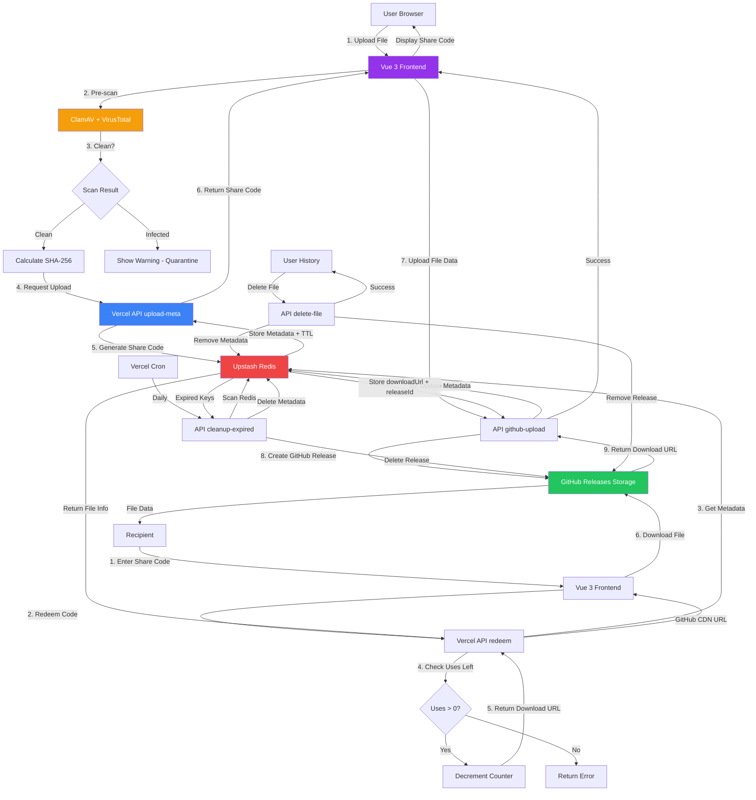

<div align="center">


# FileDuck - Secure Global File Sharing

**Fast, private, and secure file sharing with global CDN, malware scanning, and zero-knowledge encryption.**

[](LICENSE)
[](https://www.typescriptlang.org/)
[](https://vuejs.org/)
[](https://www.docker.com/)

[Features](#-features) • [Architecture](#️-architecture) • [Quick Start](#-quick-start) • [Documentation](#-documentation)

</div>

---

## 🎨 Design Highlights

FileDuck features a beautiful, modern interface with:

- **Cream & Purple Theme** - Soft, eye-pleasing color palette with purple (#9333ea) and yellow (#eab308) accents
- **9 Custom Lottie Animations** - Engaging animations throughout the user journey
- **Glassmorphism Effects** - Frosted glass UI components with backdrop blur
- **Particle Background** - Ambient floating particles for visual depth
- **Gradient Text** - Eye-catching gradient headings
- **Micro-interactions** - Hover effects, scale transforms, shimmer animations

## ✨ Features

### 🚀 Performance & Storage
- **GitHub Releases Storage** - Free, unlimited storage using GitHub Releases (production default)
- **S3/MinIO Fallback** - Alternative storage for private deployments
- **Global CDN** - CloudFront/Cloudflare edge caching for ultra-low latency
- **Direct Client Uploads** - Files uploaded directly to GitHub/S3, bypassing server bottleneck
- **Smart Chunking** - Large files split into 1.9GB chunks for reliability

### 🔒 Security
- **Pre-Upload Malware Scanning** - ClamAV + VirusTotal integration before file is published
- **Quarantine System** - Files scanned before public access
- **SHA-256 Integrity** - Client-side checksums calculated and verified on download
- **CAPTCHA Protection** - Required after 3 failed redemption attempts (production only)
- **Automatic Cleanup** - Expired files auto-deleted from storage and Redis

### 🕵️ Privacy & Control
- **One-Time Share Codes** - Atomic GET+DEL from Redis, 8-10 character Base62
- **Download Limits** - Configurable (3/5/10/unlimited uses per file)
- **Time-Limited Links** - Max 7-day TTL with automatic expiration
- **No Sign-In Required** - Upload history stored locally in browser
- **Live Countdown Timers** - Real-time expiration tracking with visual indicators
- **Anonymous Activity Feed** - Redacted filenames for privacy in live stats

### 🎨 User Experience
- **Beautiful UI** - Cream & purple theme with glassmorphism effects
- **9 Custom Lottie Animations** - Engaging animations for each step
- **Live Activity Tracker** - Real-time global upload/download statistics
- **Upload History** - Local browser storage tracks your files (no account needed)
- **Expired File Banners** - Clear visual indicators for expired uploads
- **Responsive Design** - Mobile-first, works on all devices

### 🛡️ Abuse Prevention
- **Rate Limiting** - IP-based throttling via Redis
- **Dev/Prod Mode Detection** - CAPTCHA skipped locally, enforced in production
- **Entropy Enforcement** - High-entropy codes prevent brute-force attacks
- **GitHub Release Limits** - Max 10 releases/hour to prevent abuse

## 🏗️ Architecture

### System Flow Diagram



### Key Components

- **Frontend**: Vue 3 + Vite, TailwindCSS, Lottie animations, Live countdown timers
- **Backend**: Vercel serverless functions (TypeScript)
- **Storage**: GitHub Releases (production default), S3/MinIO (fallback)
- **Cache**: Upstash Redis (metadata, rate limiting, share codes)
- **Security**: Pre-upload ClamAV + VirusTotal scanning, CAPTCHA protection
- **CDN**: GitHub CDN (automatic) or Cloudflare (optional)
- **Cleanup**: Automated daily cleanup via Vercel Cron + manual deletion API

## 📦 Monorepo Structure

```
fileduck/
├── apps/
│   ├── vue-app/          # Vue 3 + Vite frontend
│   └── api/              # Vercel serverless functions
├── packages/
│   ├── shared/           # Shared types & utilities
│   └── scanner/          # Malware scanning service
├── turbo.json
├── pnpm-workspace.yaml
└── package.json
```

## 🚀 Quick Start

### Prerequisites

- Node.js ≥18
- pnpm ≥8
- Docker (for local MinIO/ClamAV)
- Vercel CLI

### Installation

```bash
# Clone the repository
git clone https://github.com/cybe4sent1nel/FILE-DUCK.git
cd filequack

# Install dependencies
pnpm install

# Copy environment variables (use this for local dev / Vercel)
cp .env.vercel.example .env.local

# Start Docker services (MinIO, ClamAV, Redis, Scanner)
pnpm docker:up

# Start development servers (API & Vue App)
pnpm dev
```

**Available Scripts:**

```bash
pnpm start         # Start all services (Docker + Dev servers)
pnpm dev           # Start development servers only
pnpm build         # Build all packages
pnpm docker:up     # Start Docker containers
pnpm docker:down   # Stop Docker containers
pnpm docker:logs   # View Docker logs
pnpm docker:restart # Restart Docker containers
pnpm docker:clean  # Clean Docker volumes
pnpm stop          # Stop all running services
```

### Port Configuration

- **Vue App**: http://localhost:5173
- **API Server**: http://localhost:3001
- **Scanner Service**: http://localhost:4000
- **MinIO Console**: http://localhost:9001 (minioadmin/minioadmin123)
- **Redis**: localhost:6379

### Environment Variables

Use `.env.vercel.example` as the source of truth for Vercel/production. Key values:

```env
# Runtime
NODE_ENV=production
VERCEL=1
API_PORT=3001

# Storage selection
USE_GITHUB_STORAGE=true
USE_CDN=true

# GitHub Releases storage (production default)
GITHUB_TOKEN=replace-with-github-token-having-repo-permissions
GITHUB_STORAGE_OWNER=duckyoo9
GITHUB_STORAGE_REPO=fileduck-storage
GITHUB_CHUNK_SIZE=1900000000
GITHUB_ENABLE_COMPRESSION=false
GITHUB_MAX_RELEASES_PER_HOUR=10

# Redis (Upstash)
UPSTASH_REDIS_REST_URL=replace-with-upstash-rest-url
UPSTASH_REDIS_REST_TOKEN=replace-with-upstash-rest-token
# Optional legacy key/value auth
UPSTASH_REDIS_URL=
UPSTASH_REDIS_TOKEN=

# S3/MinIO (only used when USE_GITHUB_STORAGE=false)
AWS_REGION=us-east-1
AWS_ACCESS_KEY_ID=
AWS_SECRET_ACCESS_KEY=
S3_BUCKET_QUARANTINE=
S3_BUCKET_PUBLIC=
AWS_ENDPOINT=

# CDN (optional, for signed URLs)
CLOUDFLARE_DOMAIN=fileduck.vercel.app
CLOUDFLARE_TOKEN=
CLOUDFLARE_SIGNING_KEY=

# Security
RECAPTCHA_SECRET_KEY=
CRON_SECRET=replace-with-cron-bearer-token

# Frontend (Vite)
VITE_API_URL=https://fileduck.vercel.app/api
VITE_SCANNER_URL=https://scanner.fileduck.vercel.app
VITE_RECAPTCHA_SITE_KEY=
```

## 🔧 Development

```bash
# Run all apps in dev mode
pnpm dev

# Build for production
pnpm build

# Run linting
pnpm lint

# Run tests
pnpm test

# Clean build artifacts
pnpm clean
```

## 📱 Usage Flow

### Upload Journey

1. **User Experience**:
   - Drag & drop file or click to select (Upload Files.json animation)
   - Real-time SHA-256 checksum calculation
   - Configure TTL (1hr - 7 days) and download limits (1-999)
   - Optional zero-knowledge encryption

2. **Upload Process** (File Storage.json animation):
   - Request presigned multipart upload URLs from API
   - Direct upload to S3 quarantine bucket (bypasses server)
   - Backend generates secure 8-10 character share code (Base62)
   - Metadata stored in Redis with TTL

3. **Security Scan** (Scanning Document.json animation):
   - ClamAV daemon scans file signatures
   - VirusTotal API checks against 70+ engines
   - Clean files → Moved to public bucket
   - Malicious files → Quarantined (Shocked Duck.json animation)

4. **Success** (Goose Wonders.json animation):
   - Share code displayed with file details
   - Expiration time and download limits shown
   - One-click copy to clipboard

### Download Journey

1. **Code Entry** (Verify Code.json animation):
   - User enters 8-10 character share code
   - API validates code in Redis
   - Checks remaining downloads and expiration

2. **File Ready** (Data Downloading.json animation):
   - Generate signed CDN URL (1-hour TTL)
   - Display file metadata and SHA-256 checksum
   - Security verification badge

3. **Quarantine Warning** (Shocked Duck.json animation if applicable):
   - Red alert banner for flagged files
   - Detailed threat information
   - Download at own risk acknowledgment

## 🎨 UI Components & Animations

### Lottie Animations
- **File Storage** - Upload drag & drop area
- **Upload Files** - Normal upload state  
- **Scanning Document** - Malware scan in progress
- **Shocked Duck** - Malicious file detected
- **Goose Wonders** - Successful upload celebration
- **Data Downloading** - File ready for download
- **Verify Code** - Code verification screen
- **Earth Globe** - About section (global reach)
- **Error Animation** - Error state handling

### Color Palette
- **Primary**: Purple (#9333ea) - Trust, security
- **Secondary**: Yellow (#eab308) - Speed, energy
- **Background**: Cream (#fffaed) - Warmth, comfort
- **Accent Colors**: Gradients from purple to yellow

### Design Features
- Glassmorphism with backdrop blur
- Floating particle background
- Shimmer button animations
- Progress bar with animated gradient
- Hover scale transformations
- Pulse glow effects

### Landing Page Sections

1. **Hero Section**
   - Large gradient heading
   - Security badges (Virus Scanned, Encrypted, Lightning Fast)
   - Sticky navigation with blur effect

2. **How It Works**
   - 3-step visual guide with animations
   - Step 1: Upload Your File (purple theme)
   - Step 2: Security Scan (yellow theme)
   - Step 3: Share Securely (purple theme)

3. **Testimonials**
   - 3 customer reviews with 5-star ratings
   - Professional avatars and titles
   - Hover effects on cards

4. **About Section**
   - Company mission statement
   - Rotating Earth globe animation
   - Feature highlights (Security, Speed, Privacy)

5. **Trusted By**
   - Infinite scrolling brand logos
   - Microsoft, Google, Amazon, Meta, Apple, Netflix, Adobe, Spotify, Uber, Airbnb
   - Pause on hover interaction
   - Stats: 10M+ files, 500K+ users, 99.9% uptime, 150+ countries

6. **CTA (Call to Action)**
   - Purple gradient background with floating blobs
   - Upload/Download action buttons
   - Feature emojis (🔒 Secure, ⚡ Fast, 🌍 Global)

7. **Feature Cards**
   - Malware Scanned (ClamAV + VirusTotal)
   - Global CDN (Fast worldwide delivery)
   - Privacy First (One-time links & encryption)

### Download

1. User enters share code
2. API validates code in Redis
3. Check uses_left counter
4. Decrement atomically (GET+DEL)
5. Generate signed CDN URL (1-hour TTL)
6. Return presigned URL + metadata
7. Client verifies SHA-256 on download

## 🛡️ Security Measures

### Code Generation
- Base62 alphabet (a-zA-Z0-9)
- 8-10 characters = 47-59 bits entropy
- Cryptographically secure random

### Rate Limiting
- 10 requests/minute per IP
- CAPTCHA after 3 failed redemptions
- Exponential backoff

### Malware Scanning
1. Upload to quarantine bucket
2. ClamAV daemon scan (signatures)
3. VirusTotal API check (optional)
4. Score ≥3/70 = quarantine
5. Clean files → public bucket
6. Infected files → deleted + logged

### CDN Security
- Signed URLs with 1-hour expiration
- Origin access identity (OAI)
- Geographic restrictions (optional)
- DDoS protection via CloudFlare

## 🌍 Global Edge Locations

Optimized for low latency to:
- **India (Gonda, UP)** - Mumbai, Chennai PoPs
- **North America** - US East/West
- **Europe** - Frankfurt, London
- **Asia-Pacific** - Singapore, Tokyo
- **Global** - 200+ CloudFlare locations

## 📊 Comparison with Alternatives

| Feature | FileDuck | WeTransfer | SendAnywhere | Snapdrop |
|---------|----------|------------|--------------|----------|
| Malware Scan | ✅ ClamAV+VT | ❌ | ❌ | ❌ |
| Global CDN | ✅ CF/CloudFront | ✅ | ⚠️ Limited | ❌ |
| Client Encryption | ✅ Optional E2E | ❌ | ✅ | ❌ |
| One-Time Links | ✅ Atomic | ⚠️ Expires | ❌ | ✅ P2P |
| Self-Hostable | ✅ | ❌ | ❌ | ✅ |
| Cost | 💰 Minimal | 💰💰💰 Pro | 💰💰 | Free |

## 🚢 Deployment

### Vercel

```bash
# Install Vercel CLI
pnpm add -g vercel

# Deploy
vercel --prod
```

### Docker (Scanner Service)

```bash
# Build scanner image
docker build -t fileduck-scanner ./packages/scanner

# Run ClamAV + scanner
docker-compose up -d
```

### Infrastructure

```bash
# Terraform (provision S3, CloudFront, etc.)
cd infrastructure
terraform init
terraform apply
```

## 🔍 Monitoring

- **Logs**: Vercel Edge Logs + CloudWatch
- **Metrics**: Upstash metrics dashboard
- **Alerts**: SNS for malware detections
- **Tracing**: OpenTelemetry integration

## 🤝 Contributing

See [CONTRIBUTING.md](CONTRIBUTING.md)

## 📄 License

MIT License - see [LICENSE](LICENSE)

## 🙏 Credits & Tech Stack

**Frontend:**
- [Vue 3](https://vuejs.org/) - Progressive JavaScript framework
- [Vite](https://vitejs.dev/) - Lightning-fast build tool
- [TailwindCSS](https://tailwindcss.com/) - Utility-first CSS framework
- [vue3-lottie](https://www.npmjs.com/package/vue3-lottie) - Lottie animation player
- [lucide-vue-next](https://lucide.dev/) - Beautiful icon library
- [Pinia](https://pinia.vuejs.org/) - State management

**Backend:**
- [Vercel Edge Functions](https://vercel.com/docs/functions) - Serverless API
- [Express.js](https://expressjs.com/) - Local development server
- [Upstash Redis](https://upstash.com/) - Serverless Redis
- [AWS S3](https://aws.amazon.com/s3/) / [MinIO](https://min.io/) - Object storage
- [Cloudflare CDN](https://www.cloudflare.com/) - Global content delivery

**Security:**
- [ClamAV](https://www.clamav.net/) - Open-source antivirus
- [VirusTotal API](https://www.virustotal.com/) - Multi-engine malware scanner
- SHA-256 checksums for integrity verification

**DevOps:**
- [Docker](https://www.docker.com/) - Containerization
- [Turborepo](https://turbo.build/repo) - Monorepo build system
- [pnpm](https://pnpm.io/) - Fast, disk-efficient package manager
- [TypeScript](https://www.typescriptlang.org/) - Type-safe JavaScript

**Design Assets:**
- Lottie animations from [LottieFiles](https://lottiefiles.com/)
- Logo design by FileDuck team

---

<div align="center">

**Made with  and 💜 by the FileDuck Team**

[Website](https://fileduck.vercel.app) • [GitHub](https://github.com/cybe4sent1nel/FILE-DUCK) • [Documentation](./ARCHITECTURE.md) • [Report Bug](https://github.com/cybe4sent1nel/FILE-DUCK/issues)

**⭐ Star us on GitHub if you find FileDuck useful!**

</div>
